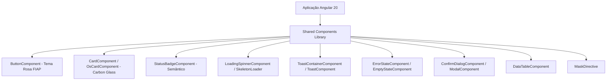
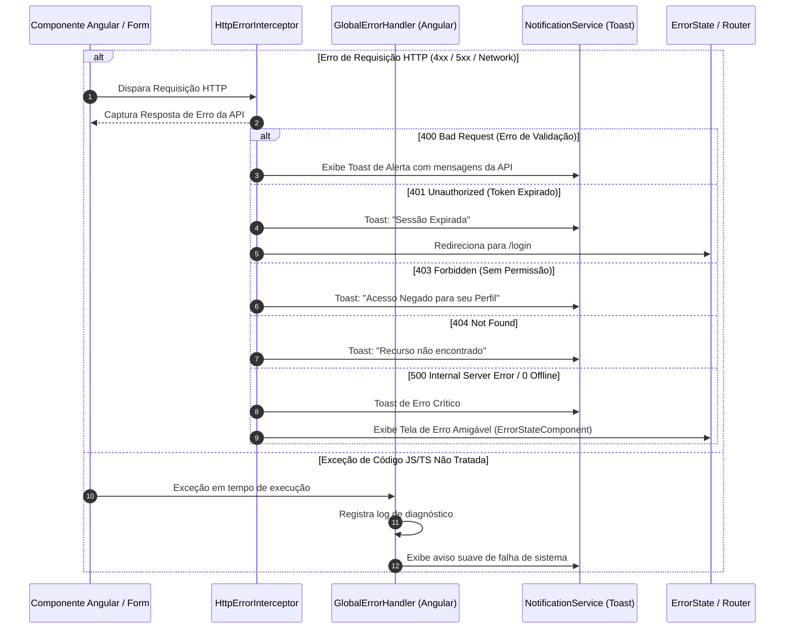

# 📐 Especificação Técnica de Arquitetura Frontend — AutoReparos (Angular 20)

**Projeto:** AutoReparos Frontend  
**Tecnologia Principal:** Angular 20 (Standalone Components, Signals, Reactive Forms, RxJS/Signals Store)  
**Identidade Visual:** FIAP Brand Theme Formal (Rosa `#ED145B`, Preto Carbon `#0A0A0C` & Prata Platinado `#E2E8F0`)  
**Integração:** Backend REST API em .NET 10 (`http://localhost:8080`) com PostgreSQL e JWT Authentication  
**Data da última atualização:** 2026-07-22  

---

## 1. 📌 Visão Geral do Sistema e Objetivos

O **AutoReparos Frontend** é a interface web responsiva, moderna e modular projetada para operar em sintonia completa com a API C# .NET 10 do **AutoReparos**. 

Seu objetivo é digitalizar todas as operações de uma oficina mecânica com suporte a visões especializadas para **cada agente operacional** (Administrador, Atendente, Mecânico e Cliente Final público), utilizando uma **arquitetura de componentes reutilizáveis**, **tratamento global de erros padronizado** e a **identidade visual corporativa da FIAP** (Rosa `#ED145B`, Preto Carbon `#0A0A0C` e detalhes técnicos em Prata Platinado `#E2E8F0`).

---

## 2. 🎨 Identidade Visual e Estética (FIAP Pink & Black Formal Theme)

A interface adota a estética oficial e sofisticada da **FIAP**:

```text
               PALETA DA MARCA (FIAP INSTITUTIONAL FORMAL)
┌──────────────────────────────────────────────────────────────┐
│  PRIMARY BRAND:    #ED145B (Official FIAP Pink)              │
│  BACKGROUND DARK:  #0A0A0C (Deep Carbon Black)               │
│  SURFACE DARK:     #18181C (Glassmorphism Slate Black)       │
│  BORDER PINK:      rgba(237, 20, 91, 0.3)                   │
│  MONOSPACE DATA:   #E2E8F0 (Crisp Platinum Silver)           │
└──────────────────────────────────────────────────────────────┘
```

- **Paleta de Cores e Tokens CSS:**
  - **Fundo Principal (Carbon Black):** `#0A0A0C` (Deep Black)
  - **Superfície dos Cards (Glassmorphism):** `#18181C` com bordas sutis `rgba(255, 255, 255, 0.08)` e aposta em auras rosadas `rgba(237, 20, 91, 0.12)`.
  - **Cor Primária da Marca:** `#ED145B` (Rosa FIAP)
  - **Hover & Destaques de Botão:** `#D0104F` com brilho rosa `rgba(237, 20, 91, 0.35)`
  - **Texto Monospaced de Dados Técnicos:** `#E2E8F0` (Prata Platinado) com badge `rgba(255, 255, 255, 0.06)`, proporcionando um visual sóbrio, formal e institucional.
- **Mapeamento Semântico de Cores dos Status da OS:**
  - `Recebida` (1): 🔵 `#3B82F6` (Blue Badge)
  - `EmDiagnostico` (2): 🟡 `#F59E0B` (Amber Badge)
  - `AguardandoAprovacao` (3): 🟣 `#8B5CF6` (Purple Badge)
  - `EmExecucao` (4): 🟠 `#F97316` (Orange Badge + Ponto Luminoso Pulsante)
  - `Finalizada` (5): 🟢 `#10B981` (Emerald Badge)
  - `Entregue` (6): ⚪ `#64748B` (Slate Grey Badge)
- **Tipografia:**
  - **Outfit (700/800):** Títulos principais, cartões e branding.
  - **Inter (400/500/600):** Corpo de texto, formulários, tabelas e parágrafos.
  - **JetBrains Mono (Silver):** Placas de veículos (`ABC1D23`), CPF/CNPJ, códigos e valores monetários.

---

## 3. 👥 Mapeamento de Telas por Agente Operacional (Perfis de Acesso)

A aplicação disponibiliza painéis e fluxos customizados para cada perfil de usuário cadastrado no backend (`ETipoUsuario`):

```mermaid
graph TD
    User[Usuário do Sistema / Visitante] --> AuthRouter{Autenticação / Perfil}

    AuthRouter -->|Sem Login| PublicAgent[Agent: Cliente Final / Público]
    AuthRouter -->|Role: Atendente| AtendenteAgent[Agent: Atendente - Recepção]
    AuthRouter -->|Role: Mecânico| MecanicoAgent[Agent: Mecânico - Oficina]
    AuthRouter -->|Role: Administrador| AdminAgent[Agent: Administrador - Gestão]

    subgraph Tela Cliente Público
        PublicAgent --> P1[Consulta Pública por Placa / CPF]
        PublicAgent --> P2[Aprovação / Recusa de Orçamento via Token]
    end

    subgraph Telas do Atendente
        AtendenteAgent --> A1[Cadastro e Busca de Clientes - CPF/CNPJ]
        AtendenteAgent --> A2[Cadastro e Vínculo de Veículos - Placa]
        AtendenteAgent --> A3[Abertura de Nova OS - Status: Recebida]
        AtendenteAgent --> A4[Disparo de Orçamento para Aprovação]
        AtendenteAgent --> A5[Checkout e Entrega do Veículo - Status: Entregue]
    end

    subgraph Telas do Mecânico
        MecanicoAgent --> M1[Fila Kanban da Oficina - Ordens Priorizadas]
        MecanicoAgent --> M2[Workbench de Diagnóstico - Iniciar Diagnóstico]
        MecanicoAgent --> M3[Inclusão de Peças/Insumos e Serviços de Mão de Obra]
        MecanicoAgent --> M4[Execução de Serviços - Iniciar / Concluir Item]
    end

    subgraph Telas do Administrador
        AdminAgent --> AD1[Dashboard Geral e Métricas da Oficina]
        AdminAgent --> AD2[Gestão de Usuários e Perfis de Acesso]
        AdminAgent --> AD3[Tabela de Insumos e Alertas de Estoque Mínimo]
        AdminAgent --> AD4[Tabela de Preços e Padrões de Serviços]
    end
```



### 3.1 Detalhes das Telas por Agente:

1. **Agente Atendente (Recepção & Atendimento):**
   - `/ordens-servico/nova`: Form de abertura de OS com busca em tempo real de clientes (CPF/CNPJ) e veículos (Placa).
   - `/clientes`: Cadastro e edição de clientes Pessoa Física e Pessoa Jurídica com validação e máscaras ativas.
   - `/veiculos`: Gestão de frota e veículos dos clientes.
   - `/ordens-servico`: Tabela geral de acompanhamento com ação rápida para realizar a entrega do veículo (transição para `Entregue`).

2. **Agente Mecânico (Oficina & Execução Técnica):**
   - `/ordens-servico/fila`: **Fila Kanban da Oficina** ordenada por prioridade (`Em Execução` > `Aguardando Aprovação` > `Em Diagnóstico` > `Recebida`).
   - `/ordens-servico/:id`: **Workbench do Mecânico** para registrar o diagnóstico, adicionar peças/insumos consumidos, adicionar serviços de mão de obra e alternar o status dos itens para `EmExecucao` e `Concluido`.

3. **Agente Administrador (Gestão Operacional):**
   - `/dashboard`: Métricas de faturamento estimado, tempo médio de atendimento e status das ordens.
   - `/insumos`: Tabela de insumos/peças com indicador visual destacado para itens abaixo do **Estoque Mínimo**.
   - `/servicos`: Cadastro de serviços e tempos médios de execução.
   - `/usuarios`: Gestão de contas de acesso (Atendentes, Mecânicos e Administradores).

4. **Agente Cliente Final (Acesso Público sem Login):**
   - `/consulta-publica`: Portal responsivo para o cliente acompanhar o status do veículo digitando Placa ou CPF/CNPJ.
   - `/aprovar-orcamento?token=...`: Página segura para aprovar ou recusar orçamentos com 1-clique via token recebido por e-mail.

---

## 4. 🧩 Componentização e Reutilização de UI (Shared Component Library)

Todos os elementos visuais são estritamente **componentizados e reutilizáveis**, evitando duplicação de HTML/CSS:



---

## 5. 🛡️ Arquitetura de Tratamento Global de Erros (Error Handling)

Nenhum erro de requisição HTTP ou exceção não tratada quebrará a experiência do usuário. Todos os erros passam por um pipeline centralizado de captura e tratamento:



---

## 6. 📂 Estrutura Visual de Diretórios e Arquivos

```text
AutoReparos-Frontend/
├── angular.json
├── package.json
├── tsconfig.json
├── tailwind.config.js
└── src/
    ├── main.ts
    ├── index.html
    ├── styles.css
    └── app/
        ├── app.component.ts
        ├── app.routes.ts
        ├── app.config.ts
        ├── core/
        │   ├── handlers/global-error.handler.ts
        │   ├── guards/auth.guard.ts & role.guard.ts
        │   ├── interceptors/jwt.interceptor.ts, error.interceptor.ts & loading.interceptor.ts
        │   ├── models/ (cliente, veiculo, insumo, servico, ordem-servico, usuario)
        │   └── services/ (auth, cliente, veiculo, insumo, servico, ordem-servico, usuario)
        ├── features/
        │   ├── auth/login/
        │   ├── dashboard/
        │   ├── ordens-servico/ (fila-kanban, lista-os, form-os, detalhe-os)
        │   ├── clientes/ & veiculos/
        │   ├── insumos/ & servicos/
        │   ├── usuarios/
        │   └── portal-publico/ (consulta-publica, aprovacao-orcamento)
        └── shared/
            ├── components/ (button, card, os-card, status-badge, loading-spinner, toast, error-state, confirm-dialog, data-table)
            ├── directives/mask.directive.ts
            └── pipes/status-os.pipe.ts, cpf-cnpj.pipe.ts & placa.pipe.ts
```

---

## 7. 🏁 Plano de Ação para Implementação

1. **Setup do Projeto:** Criar aplicação em Angular 20 na pasta `AutoReparos-Frontend` aplicando os tokens CSS da marca FIAP (Rosa `#ED145B`, Preto Carbon `#0A0A0C` & Prata Platinado `#E2E8F0`).
2. **Biblioteca de Componentes Reutilizáveis (`shared/`):** Implementar `Button`, `Card`, `StatusBadge`, `Toast`, `LoadingSpinner`, `ConfirmDialog` e `ErrorState`.
3. **Pipeline de Erros & Autenticação (`core/`):** Implementar `GlobalErrorHandler`, `HttpErrorInterceptor`, `AuthGuard` e `RoleGuard`.
4. **Telas dos Agentes (Atendente, Mecânico, Admin, Cliente Público).**
5. **Integração e Testes:** Validar comunicação de ponta a ponta com a API REST C#.
